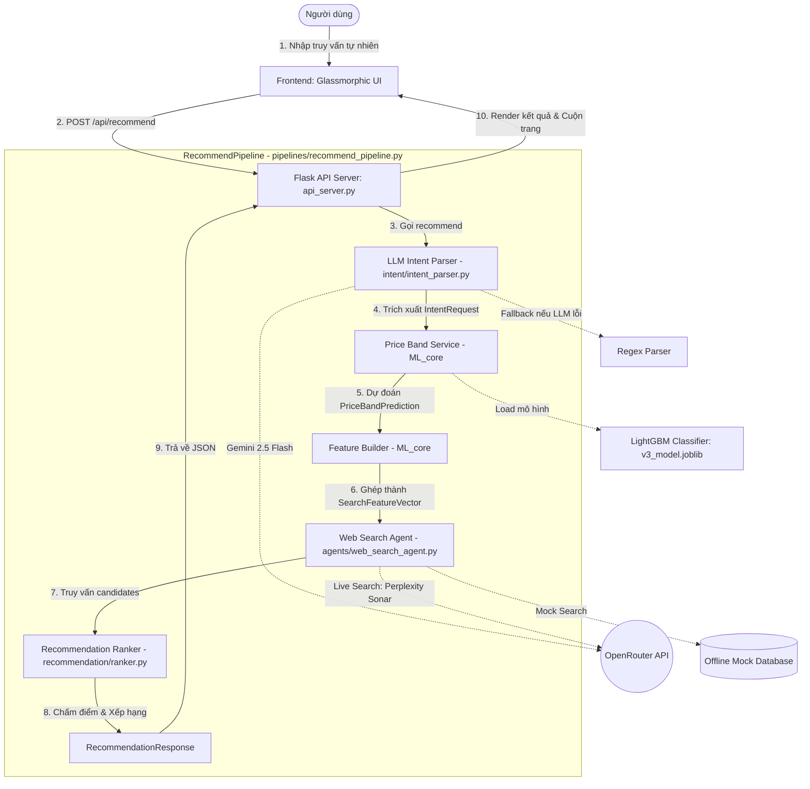

# Travely AI Travel Concierge — System Architecture & Workflow Presentation Guide

Chào anh và team! Dưới đây là tài liệu tổng quan kiến trúc hệ thống và luồng xử lý chi tiết (Workflow) của dự án **Travely AI Travel Concierge** được trích xuất trực tiếp từ codebase thực tế. Tài liệu này được thiết kế cấu trúc rõ ràng, trực quan để anh và team dễ dàng nắm vững kiến trúc và tự tin thuyết trình (Present) trước hội đồng/khách hàng.

---

## 1. Tổng Quan Kiến Trúc Hệ Thống (System Overview)

Hệ thống hoạt động theo mô hình **Client-Server (REST API)**, kết hợp giữa mô hình học máy truyền thống (LightGBM) và các mô hình ngôn ngữ lớn (LLM) thông qua OpenRouter API.



---

## 2. Quy Trình Chạy Hệ Thống Từng Bước (Concise Run Workflow)

Khi người dùng nhập câu hỏi (ví dụ: *"khách sạn Phú Quốc dưới 3 triệu có hồ bơi"*), hệ thống chạy qua 6 bước cực kỳ rõ ràng sau:

```
[UI/Nút bấm] ➔ [Flask API] ➔ [LLM Parse Intent] ➔ [LightGBM Predict Price] ➔ [Perplexity Search Web] ➔ [Ranker Chấm Điểm] ➔ [Kết quả hiển thị]
```

1. **Bước 1: Nhận Đầu Vào (Frontend UI - `Vite/App.js`)**
   * Người dùng nhập text. Giao diện mở rộng ngay lập tức, hiển thị hộp suy luận dynamic o1-style (tiến trình suy luận nhấp nháy chuyển màu cầu vồng).
2. **Bước 2: Tiếp Nhận & Điều Phối (API Server - `api_server.py`)**
   * Route `/api/recommend` tiếp nhận request JSON, gọi pipeline trung tâm điều phối dữ liệu qua các khối xử lý.
3. **Bước 3: Phân Tích Ý Định (LLM Intent Parser - `intent_parser.py`)**
   * Gọi model `gemini-2.5-flash` phân tích cú pháp câu hỏi tự nhiên thành object JSON cấu trúc: địa danh, số lượng khách, tiện ích mong muốn.
   * *Fallback:* Nếu LLM lỗi mạng/hết quota $\rightarrow$ Tự động chuyển qua **Regex Parser** để trích xuất nhanh không gián đoạn.
4. **Bước 4: Dự Đoán Phân Khúc Giá (Price Classifier - `price_band_service.py`)**
   * Nạp file mô hình học máy **LightGBM** (`price_classification_v3_model.joblib`).
   * Dự đoán xác suất phân khúc giá (Budget, Economy, Mid-range, Upscale, Premium) dựa trên các thuộc tính của Intent.
5. **Bước 5: Tìm Kiếm Deal Thực Tế (Web Search - `web_search_agent.py`)**
   * Tự động sinh từ khóa tìm kiếm nâng cao dựa trên Intent + Price Band.
   * Gọi mô hình **`perplexity/sonar`** quét internet theo thời gian thực tìm các khách sạn có thực trên Agoda/Booking.com (Hoặc truy xuất Mock DB cục bộ nếu cấu hình offline).
6. **Bước 6: Chấm Điểm & Xếp Hạng (Ranker - `ranker.py`)**
   * Chấm điểm từng khách sạn tìm được theo 4 tiêu chí: **Độ phù hợp giá (Price Fit)**, **Tiện ích (Amenity Fit)**, **Vị trí (Location Fit)**, **Sức chứa (Capacity Fit)**.
   * Sắp xếp điểm giảm dần và hiển thị lên giao diện kèm hiệu ứng tự động cuộn trang (Smooth Auto-scroll) để người dùng xem ngay.

---

## 3. Chi Tiết Input/Output và Vị Trí Code Từng Phase

Dưới đây là bảng đặc tả chi tiết về **Input**, **Output** và **Vị trí file/code** cho từng phase của hệ thống để anh và team dễ dàng thuyết trình sâu vào code:

### Phase 1: API Router & Coordination (Điều Phối)
* **Vị trí file/code:** `api_server.py` (hàm `recommend_route`) & `pipelines/recommend_pipeline.py` (hàm `recommend`)
* **Input:**
  * Định dạng: JSON HTTP Request
  * Ví dụ:
    ```json
    { "query": "khách sạn Phú Quốc có hồ bơi dưới 3 triệu" }
    ```
* **Output:**
  * Định dạng: Object `RecommendationResponse` (convert thành JSON HTTP Response trả về UI)

### Phase 2: Phân Tích Ý Định (LLM Intent Parsing)
* **Vị trí file/code:** `intent/intent_parser.py` (hàm `IntentParser.parse`)
* **Input:**
  * Loại dữ liệu: `raw_query: str`
  * Ví dụ: `"khách sạn Phú Quốc có hồ bơi dưới 3 triệu"`
* **Output:**
  * Dữ liệu trả về: Dataclass `IntentRequest` (định nghĩa tại `ML_core/core/schemas.py`)
  * Ví dụ:
    ```python
    IntentRequest(
        raw_query="khách sạn Phú Quốc có hồ bơi dưới 3 triệu",
        destination="Phu Quoc",
        budget_min_vnd=None,
        budget_max_vnd=3000000.0,
        amenities=["pool"],
        location_preferences=[],
        property_types=["hotel"]
    )
    ```

### Phase 3: Dự Đoán Phân Khúc Giá (Price Band Prediction)
* **Vị trí file/code:** `ML_core/core/price_band_service.py` (hàm `PriceBandService.predict_price_band`)
* **Input:**
  * Loại dữ liệu: Dataclass `IntentRequest` (từ Phase 2)
* **Output:**
  * Dữ liệu trả về: Dataclass `PriceBandPrediction` (định nghĩa tại `ML_core/core/schemas.py`)
  * Ví dụ:
    ```python
    PriceBandPrediction(
        price_class_id=2,
        price_class_label="mid_range",
        probabilities={"budget": 0.02, "economy": 0.08, "mid_range": 0.85, "upscale": 0.04, "premium_luxury": 0.01},
        confidence=0.85,
        price_min_vnd=1000000.0,
        price_max_vnd=2500000.0
    )
    ```

### Phase 4: Xây Dựng Vector Đặc Trưng (Feature Vector Building)
* **Vị trí file/code:** `ML_core/core/feature_builder.py` (hàm `FeatureBuilder.build`)
* **Input:**
  * Dữ liệu: `IntentRequest` (từ Phase 2) & `PriceBandPrediction` (từ Phase 3)
* **Output:**
  * Dữ liệu trả về: Dataclass `SearchFeatureVector` (định nghĩa tại `ML_core/core/schemas.py`)
  * Ví dụ:
    ```python
    SearchFeatureVector(
        destination="Phu Quoc",
        guest_count=None,
        price_min_vnd=1000000.0,
        price_max_vnd=3000000.0, # Gộp và tối ưu từ cả Intent và PriceBand
        price_class_id=2,
        price_class_label="mid_range",
        price_class_confidence=0.85,
        amenity_pool=1, # 1: Yêu cầu có hồ bơi
        amenity_beach=0,
        amenity_breakfast=0,
        near_beach=0,
        near_center=0,
        property_type_hotel=1,
        property_type_apartment=0,
        property_type_resort=0,
        expand_budget=False,
        raw_query="khách sạn Phú Quốc có hồ bơi dưới 3 triệu"
    )
    ```

### Phase 5: Tìm Kiếm Trực Tuyến (Web Search Agent)
* **Vị trí file/code:** `agents/web_search_agent.py` (hàm `WebSearchAgent.search`)
* **Input:**
  * Loại dữ liệu: Dataclass `SearchFeatureVector` (từ Phase 4)
* **Output:**
  * Dữ liệu trả về: `tuple(list[RecommendationCandidate], list[str])`
  * Ví dụ cụ thể của một `RecommendationCandidate` (định nghĩa tại `recommendation/schemas.py`):
    ```python
    RecommendationCandidate(
        name="Seashell Resort & Spa Phú Quốc",
        source_url="https://www.booking.com/hotel/vn/seashells-phu-quoc.html",
        price_vnd=2599946.0,
        destination="Phu Quoc",
        amenities=["pool", "breakfast", "beach", "spa"],
        location_tags=["near beach"],
        property_type="resort",
        source_quality=0.95
    )
    ```

### Phase 6: Chấm Điểm & Xếp Hạng (Recommendation Ranking)
* **Vị trí file/code:** `recommendation/ranker.py` (hàm `RecommendationRanker.rank`)
* **Input:**
  * Dữ liệu: `SearchFeatureVector` (từ Phase 4) & `list[RecommendationCandidate]` (từ Phase 5)
* **Output:**
  * Dữ liệu trả về: `list[RankedRecommendation]` (chứa candidate, score, reasons, tradeoffs)
  * Ví dụ:
    ```python
    RankedRecommendation(
        candidate=RecommendationCandidate(...),
        score=0.9670,
        reasons=["price_fit", "amenity_fit", "location_fit"],
        tradeoffs=[]
    )
    ```

---

## 4. Các Điểm Sáng Công Nghệ Cần Nhấn Mạnh Khi Thuyết Trình

> [!TIP]
> Hãy tận dụng các điểm sáng này để tạo ấn tượng mạnh trước hội đồng chấm thi:

1. **Hybrid Architecture (Kết hợp ML và LLM):** Tận dụng tối đa điểm mạnh của cả hai. Dùng học máy truyền thống (LightGBM) để dự đoán giá chuẩn xác và chấm điểm học thuật, đồng thời kết hợp sức mạnh phân tích ngôn ngữ tự nhiên vượt trội của LLM để hiểu ý định khách hàng.
2. **Real-time Web Verification via Perplexity API:** Hệ thống không chỉ khuyến nghị dữ liệu tĩnh mà có thể "lướt web trực tiếp" tìm các deal phòng thực tế trên Agoda, Booking.com... tại thời điểm người dùng hỏi.
3. **Robust Codebase (Cơ chế Fallback thông minh):** 
   * Bộ trích xuất JSON nâng cao (`extract_json_from_text`) tự lọc bỏ mọi ký tự thừa/markdown của LLM.
   * Cơ chế tự động fallback sang Regex khi LLM OpenRouter bị lỗi, giữ hệ thống luôn ổn định.
4. **Premium UX/UI Design:** Hộp hội thoại có đường viền cầu vồng chuyển động, và đặc biệt là bảng **suy luận o1-style** giúp người dùng thấy rõ AI đang "suy nghĩ" gì dưới backend, tạo ra trải nghiệm sử dụng đỉnh cao.

---

Chúc anh và team có một buổi thuyết trình thành công rực rỡ! Nếu cần điều chỉnh hay bổ sung thông tin gì, anh cứ báo em nhé.
